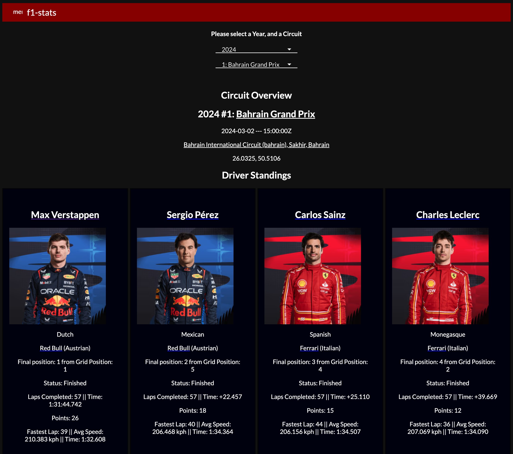
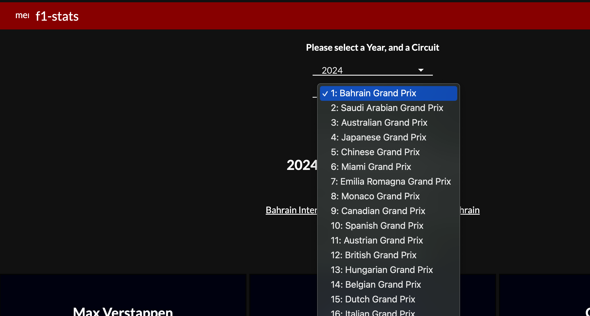
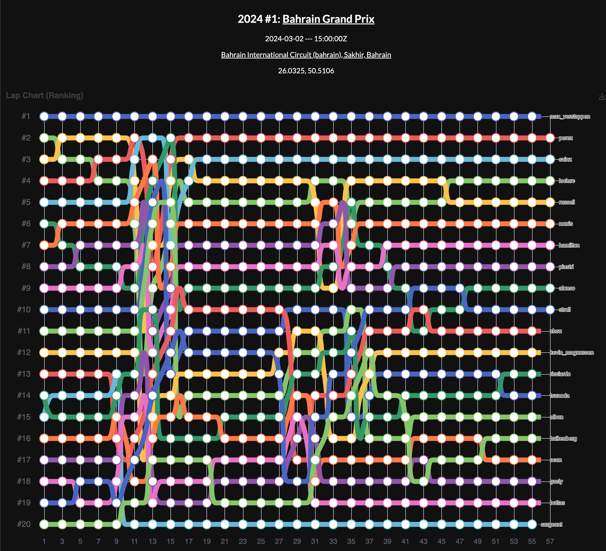

# f1-stats UI and API
### Angular, Flask, Docker (not enough time given to add state management, lazy-loading, offsets for endpoints, more testing, etc.)

Driver standings:

Dropdown:

Lap chart:

Requirements vague:
- Select a specific race event 
- Visualisations that allow us to understand what happened during the race. 
- Elements of the available data that help a user's understanding. 
- Visualisation with an interactive tool - ideally providing levels of detail.
You can use any language you like to produce the application, which should be returned by email. Ideally the solution should run in a docker container that manages and localises the project dependencies and it should work with any modern browser.

Built with:
- Angular - Front-End JavaScript framework.
- Docker - Employed Docker Compose to build and host app.
- Flask - Back-End Python framework.
- nginx - web server, and reverse proxy. External user hits the nginx - distributes request to UI or Server.
- uwsgi - WSGI server - direct support for popular NGINX web server.

Solution features:
- Project structure supports multiple Dev environments with the usage of `.env` variable and `docker.compose.yml` files.
- Optimised for large scale app structure, with `Blueprints`, `application factory` and several configs that can be extended from this seed project to any Prod-ready app.
- Flask code Testing.
- Reverse proxy (`nginx`.)

## Project Directory

### docker-compose.yml

To create containers and run the app. Several versions, i.e. for different environments.

### .env File

(Wouldn't usually commit this.) Environment variables for Flask and SQLite3. Several versions, i.e. for different environments.

### nginx

nginx config file, and Dockerfile for running the nginx container which serves the Angular code and passes requests to Flask-based API.

### server

**Flask** app, **tests** setup, configs and settings files, Dockerfile for running the Flask container, etc..

***Requirements***
`pip freeze -r requirements.txt | sed '/freeze/,$ d'`

### ui

Angular code.

This project was generated with [Angular CLI](https://github.com/angular/angular-cli) version 9.

*** Development server *** 

Run `ng serve` for a dev server. Navigate to `http://localhost:4200/`. The app will automatically reload if you change any of the source files.

*** Code scaffolding *** 

Run `ng generate component component-name` to generate a new component. You can also use `ng generate directive|pipe|service|class|guard|interface|enum|module`.

*** Build *** 

Run `ng build` to build the project. The build artifacts will be stored in the `dist/` directory. Use the `-prod` flag for a production build.

***  Running unit tests *** 

Run `ng test` to execute the unit tests via [Karma](https://karma-runner.github.io).

***  Running end-to-end tests *** 

Run `ng e2e` to execute the end-to-end tests via [Protractor](http://www.protractortest.org/).
Before running the tests make sure you are serving the app via `ng serve`.

***  Further help *** 

To get more help on the Angular CLI use `ng help` or go check out the [Angular CLI README](https://github.com/angular/angular-cli/blob/master/README.md).

## Architecture

2 Docker containers built using separate Dockerfiles, created and connected with Docker Compose, and which expand upon the respective official images from Docker Hub:
- FLASK - Flask web application with _uwsgi_ server.
- NGINX - Angular web client

### Requests

External requests hit the _nginx_ web server's port 80, and the response is by Angular or Flask depending on the **URL**. 
- _/api_ is sent to Flask docker container (port 5000; as per the _nginx.conf_ file. nginx is aware of both the Angular and Flask services.) 
- **Future feature to implement:** Flask container connects via port 1234 to the database.

## Running the App

**NB.**: [Angular Prerequisites] (https://github.com/angular/angular-cli#prerequisites): Docker, node, npm and angular-cli.

- Navigate to the `ui` directory. 
Execute `ng build --prod` to create a production build for Angular.
- Navigate back to the parent. Execute following commands:
  - `docker-compose -f docker-compose.yml up --build`
  - Without cache `docker-compose build --no-cache`
- Open Browser and type following URL:
- `localhost` - It should display the Welcome message from Angular and a default message from
  backend.
- `localhost/api` - It should display welcome message from Flask.
- `localhost/api/ping` - To get a `json` from Flask.

## Running the Tests:

- Flask (Python) unit tests are in the `server/tests` directory and managed by `manage .py` Python file.
- Run with:
  - `docker-compose -f docker-compose.yml run --rm f1_stats_flask python manage.py test`